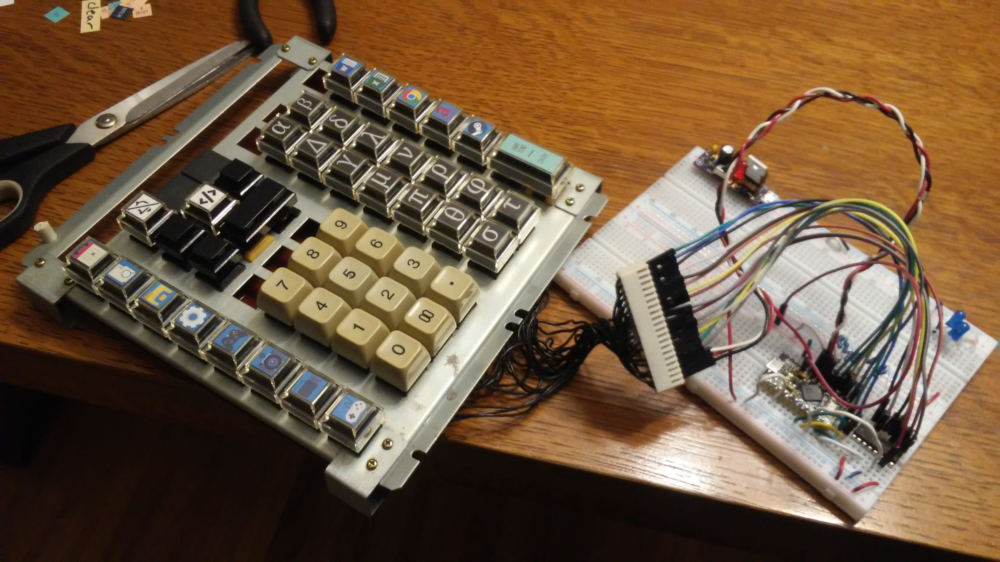

# hotkeyboard

Keyboard layout:

A1 B1 -- -- -- -- --
A2 B2 C2 D2 E2 F2 G2
A3 B3 C3 -- E3 F3 G3
A4 -- -- -- E4 F4 G4
A5 B5 C5 D5 E5 F5 G5
A6 B6 C6 D6 E6 F6 G6
A7 B7 C7 D7 E7 F7 G7
A8 B8 C8 D8 E8 F8 --

Master list of keys:

 | --- | A | B | C | D | E | F | G | 
 | 1 | Superscript (Word) | Piezo tune | -- | -- | -- | -- | -- | 
 | 2 | Subscript (Word) | Mute | Volume down | Volume up | Alpha | Beta | Change font to Symbol | 
 | 3 | Default formatting (Word) | Start/stop recording |  | -- | Delta(uppercase) | Delta | Degree symbol | 
 | 4 | Increase font size (Word) | -- | -- | -- | Gamma | Lambda | Del(partial derivative) | 
 | 5 | Decrease font size (Word) | 7 | 8 | 9 | Mu | Nu | Epsilon | 
 | 6 | Scientific format (Excel) | 4 | 5 | 6 | Pi | Rho | Omega | 
 | 7 | Currency format (Excel) | 1 | 2 | 3 | Theta | Phi | Sigma(uppercase) | 
 | 8 | Add borders to cell (Excel) | 0 | 00 | . | Sigma | Tau | -- | 
