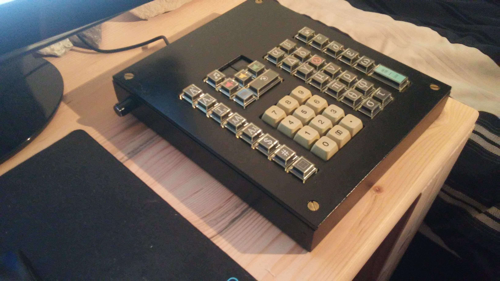
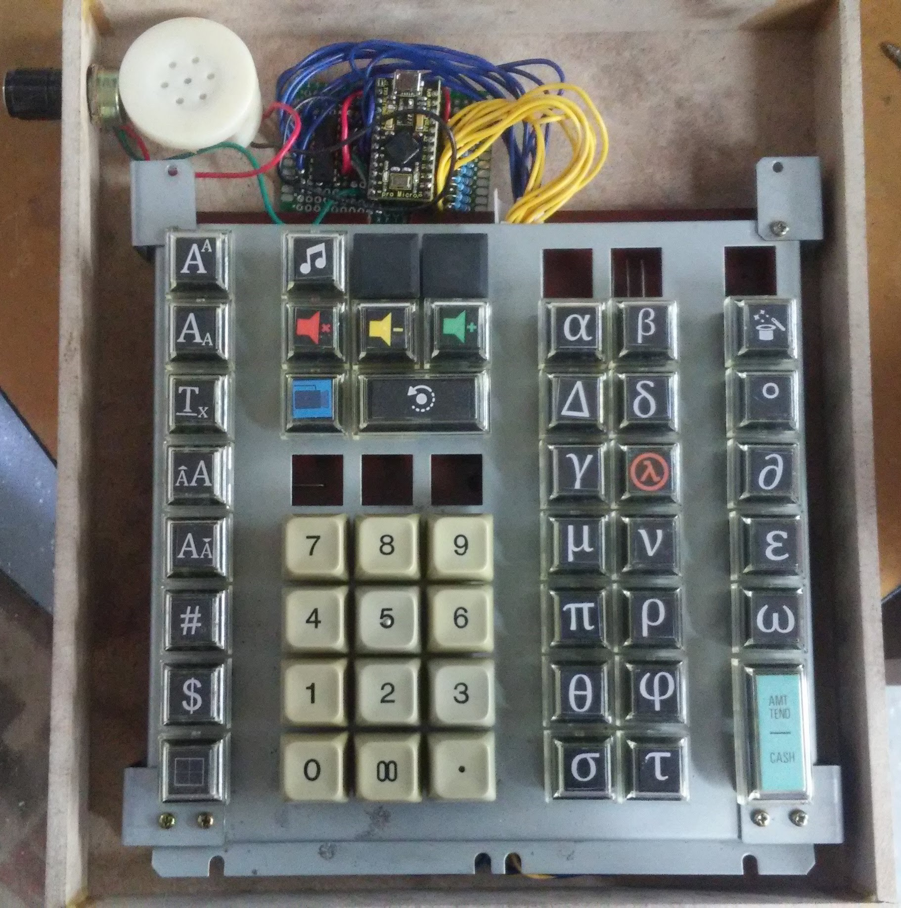

# hotkeyboard

In-depth blog post: https://brycedombrowski.com/2019/08/summer-2019-custom-hotkey-keypad-project/

Master list of keypad functions:

 | | A | B | C | D | E | F | G | 
 | --- | --- | --- | --- | --- | --- | --- | --- |
 | 1 | Superscript (Word) | Piezo tune | -- | -- | -- | -- | -- | 
 | 2 | Subscript (Word) | Mute | Volume down | Volume up | Alpha | Beta | Change font to Symbol (Word) | 
 | 3 | Default formatting (Word) | Start/stop recording | Record last 30 seconds | -- | Delta(uppercase) | Delta | Degree symbol | 
 | 4 | Increase font size (Word) | -- | -- | -- | Gamma | Lambda | Del(partial derivative) | 
 | 5 | Decrease font size (Word) | 7 | 8 | 9 | Mu | Nu | Epsilon | 
 | 6 | Scientific format (Excel) | 4 | 5 | 6 | Pi | Rho | Omega | 
 | 7 | Currency format (Excel) | 1 | 2 | 3 | Theta | Phi | Sigma(uppercase) | 
 | 8 | Add borders to cell (Excel) | 0 | 00 | . | Sigma | Tau | -- | 
